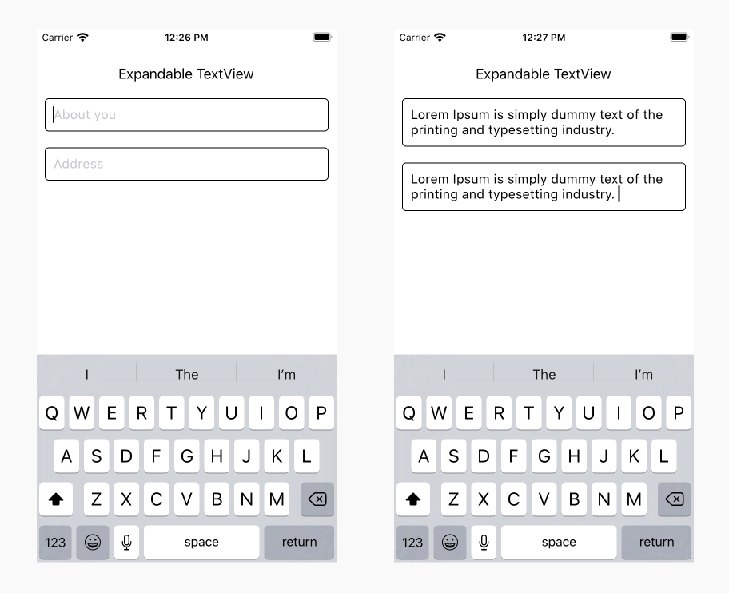

# React Native - Expandable TextView

A React Native based component for creating Expandable TextView in your application. 

## Getting started

- [Demo](#demo)
- [Installation](#installation)
- [Supported versions](#supported-versions)
- [Usage](#usage)
- [Props](#props)
- [Methods](#methods)
- [Want to Contribute?](#want-to-contribute?)
- [Collection of Components](#collection-of-components)
- [Changelog](#changelog)
- [License](#license)
- [Keywords](#keywords)

## Demo

[](https://github.com/weblineindia/React-Native-Expandable-Textview/ExpandableTextView.png)

## Installation

`$ npm install rn-weblineindia-expandable-textview --save`

## Supported versions

We have tested this component in ReactNative 0.60 - 0.62.5. You can still use it in other versions.

## Usage

Here is a sample screen in which you can implement the Expandable TextView Component.

```javascript
import ExpandableTextField from 'rn-weblineindia-expandable-textview';

 <ExpandableTextField
  style={{}}
  value={this.state.inputValue}
  onChangeText={(text) => console.log('Text--->',text)}
  maxHeight={250}
  selectionColor={'black'}
  placeholder={'Please enter Address'}
  blurOnSubmit={true}
/>
```

### Callback

```javascript
onChangeText={() => }
onSubmitEditing={() => }
onFocus={() => }
onBlur={() => }
onChange={() => }
onEndEditing={() => }
```

### Methods
.focus() 
.blur()
.clear();

## Props

| **Props**           | **Type** | **Required** | **Description**                                                               |
|---------------------|----------|--------------|-------------------------------------------------------------------------------|
| maxHeight           | `number` | no           | Defines maximum height for textinput. Default 100.                            |
| refData             | `string` | no           | Defines reference of textinput                                                |
| mutiline            | `boolean`| Yes          | Always true for multiline textinput                                           |
| blurOnSubmit        | `boolean`| Yes          | Always true for multiline textinput                                           |


## Methods

| **Method**           | **Description**                                                                            |
|----------------------|--------------------------------------------------------------------------------------------|
| onChangeText         | Callback that is called when the text input's content size changes.                        |
| onSubmitEditing      | Callback that is called when the text input's submit button is pressed with the argument.  |
| onFocus              | Callback that is called when the text input is focused.                                    |
| onBlur               | Callback that is called when the text input is blurred.                                    |
| onChange             | Callback that is called when the text input's text changes.                                |
| onEndEditing         | Callback that is called when text input ends.                                              |
| focus                | Makes the native input request focus.                                                      |
| blur                 | Makes the native input lose focus.                                                         |
| clear                | Removes all text from the TextInput.                                                       |


-----

## Want to Contribute?

- Created something awesome, made this code better, added some functionality, or whatever (this is the hardest part).
- [Fork it](http://help.github.com/forking/).
- Create new branch to contribute your changes.
- Commit all your changes to your branch.
- Submit a [pull request](http://help.github.com/pull-requests/).

-----

## Collection of Components

We have built many other components and free resources for software development in various programming languages. Kindly click here to view our [Free Resources for Software Development](https://www.weblineindia.com/software-development-resources.html).

------

## Changelog

Detailed changes for each release are documented in [CHANGELOG.md](./CHANGELOG.md).

------

## License

[MIT](LICENSE)

[mit]: https://github.com/weblineindia/React-Native-Expandable-Textview/blob/master/LICENSE

------

### Keywords

 rn-weblineindia-expandable-textView, react-native-expandable-textView, expandable-textView, react-native
